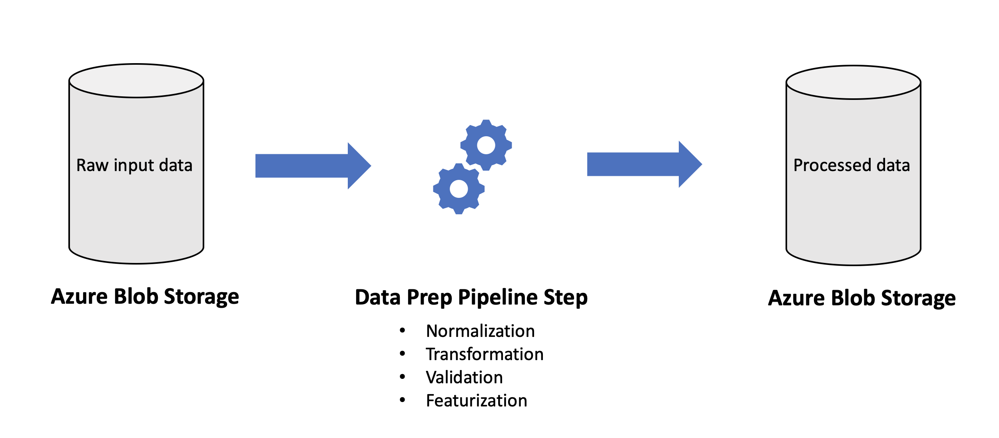

# Overview of machine learning pipelines using the Azure Machine Learning SDK

## What are machine learning pipelines?

Machine learning pipelines are cyclical and iterative in nature that facilitate both continuous improvement of model performance and deploying and making inferences on the best performing model to date. The pipelines comprise of distinct steps, for example, data preparation, model training, and batch predictions. Often data scientists, data engineers and IT professionals need to collaborate on building robust, scalable, and reusable machine learning pipelines.

The following diagram shows an example pipeline:

The [Azure Machine Learning SDK for Python](https://docs.microsoft.com/en-us/python/api/azureml-pipeline-core/?view=azure-ml-py) allows you to create ML pipelines, and also submit and track individual pipeline runs. You can build reusable pipelines that optimize your specific workflows and allows you to focus on your expertise, for example machine learning, instead of the infrastructure to build and manage the pipelines.

The purpose of this article to show how to build an example machine learning pipeline work flow, that includes repeatable data preparation, model training and batch predictions using the Azure Machine Learning SDK for Python within Azure notebooks.

## Creating a pipeline for repeatable data prep and model training using Azure Notebooks

One of the ways to use the Azure Machine Learning SDK for Python is with Azure notebooks. In the introduction we saw how to get started with Azure notebooks, and how to create Azure Machine Learning workspace in your subscription. In this section we will describe how to use the Azure notebooks to build repeatable data preparation and model training pipeline with explicit dependency between the two pipeline steps.

### Create a new notebook

In Azure notebooks, when you select Run to start your project, it opens Jupyter Notebooks interface. From within the Jupyter Notebooks interface, create a new notebook with Python 3.6 kernel as shown.

Now you are ready to write your code in the notebook.

### Create Data Preparation Pipeline Step

In the data preparation pipeline step, we take the raw input data, process the input data, and output the processed data that will be used in the model training step.

#### Get the reference to raw input data

## Creating a pipeline for repeatable data prep and batch scoring using Azure Notebooks
