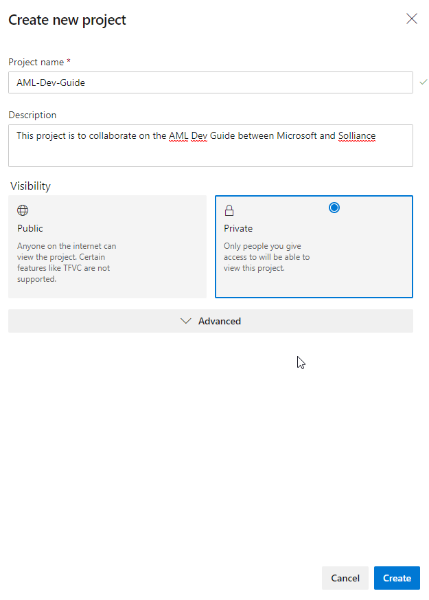
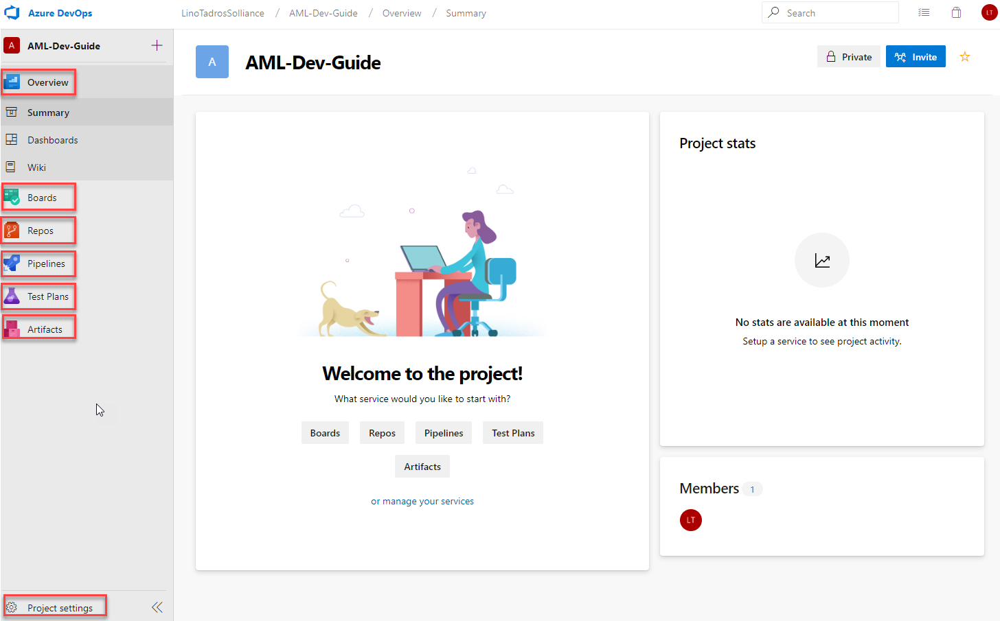
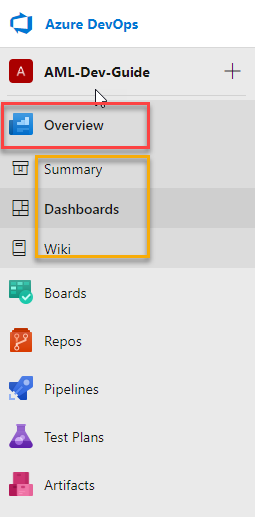
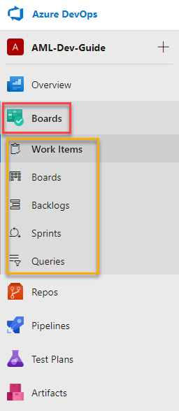
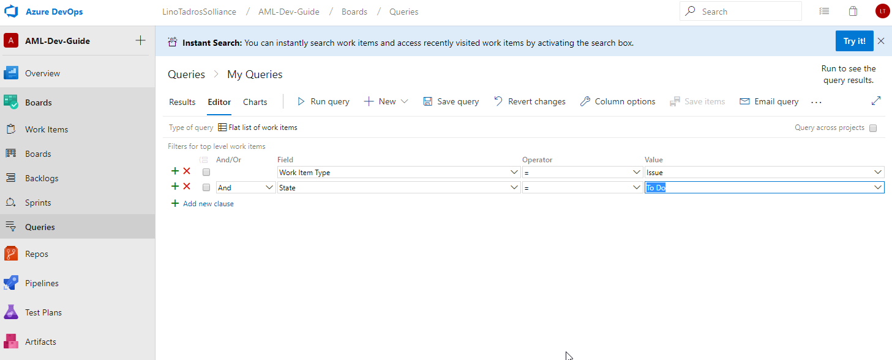
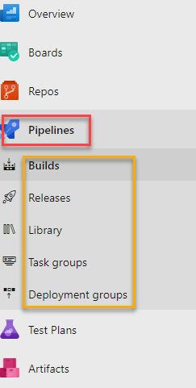
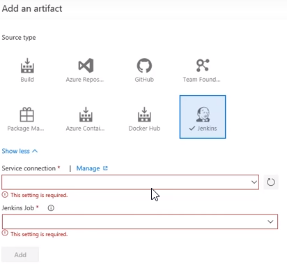
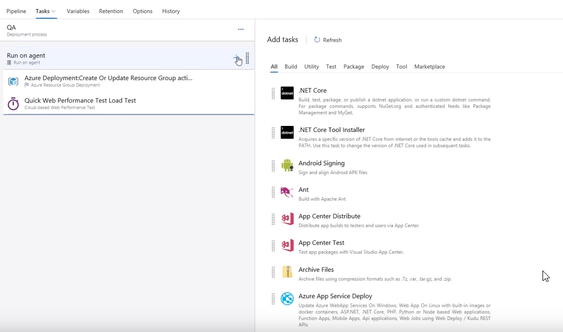

# Using Azure DevOps

Azure DevOps provides developer services to support teams to plan work, collaborate on code development, and build and deploy applications. Developers can work in the cloud using Azure DevOps Services or on-premises using Azure DevOps Server, formerly named Visual Studio Team Foundation Server (TFS).

## Why Use Azure DevOps?
- It is perfect for turning your idea into a piece of Software.
- Helps you plan your solution with Agile Tools
- Enables source code management using Git and other first class source control systems
- Deploys your solution to Cross Platform CI/CD-enabled systems
- Provides full traceability and visibility across your entire solution development lifecycle.

## How to Get started?

To get started, create an account on https://dev.azure.com
This is where you will have access to all your Projects and also your associated Organization.

## Create a Project
Click on the **Create Project** button to start a new Project in Azure DevOps.

Once the project is created, you will be able to manage Your project, Boards, Repositories, Pipeline, Test Plans, Artifacts and all your Project Settings from your DevOps Project screen.

## Overview
In this tab you will be able to see a summary of your Project, project stats and participating members on the team.

From the Dashboards sub tab you will be able to generate screens that utilize widgets to drag and drop into your dashboards to make it easy to oversee the health and progress of your project.

On the Wiki sub tab, you will be able to create a Wiki repository for your project to share information with the rest of your team reagrding the project, where markdown is supported.

## Boards
You can use Azure Boards to display Kanban boards to plan and check your entire release. You will be able to create sprints and move work items from different states until completion and release of your product.

In **Backlogs** you will be able to drag and drop your items to the desired sprint and monitor all your backlog items in the system that are yet to be completed.

In **Sprints** you will be able to track your progress on the **TaskBoard** and move items from one sprint to another easily.  You can even create **Branches** right from the board, if need be.

In **Queries**, this is where you would create your favorite queries about a group of items in the project's work items to quickly execute them in the future

## Repos

Repos in Azure DevOps are extremely important to manage your project files and source control, whether you are using a centralized source control or Distributed source control (like Git)

The Files sub tab will allow you to view the files and structure of your repository and make changes if desired.

**Commits**, allows you to see how all your branches come together.

**Pushes**, give you a historic view of all the changes made to the remote repository.

**Branches**, will enable to view all the branches and see if they are ahead or behind master.

**Tags**, will allow you to view all the Tags created for the project and even create new ones.

**Pull Requests**, will allow you review and participate in Pull Requests in the project.  You can also create policies to fire up a build automatically based on a pull request.

## Azure Pipelines

This is a rich Cross Platform CI/CD system capable of building any language targeting any platform.

From the summary page, you will be able to review commits, test results and perform many actions on your project. The Deployment section in the summary will be able to show you were in the release your project is currently.

The real power of Azure Pipelines starts manifesting itself when you get to the **Build** edit screen.

Azure Pipelines can pull your code from the most popular source control systems.

Azure Pipelines also offer hosted Windows, Mac and Linux operating build agents.

On the **Releases** sub tab, you will be able to create a new pipelines where you can start with an empty job or drag and drop a featured deployment pipeline from the many templates available in Azure Pipelines.

You are able to deploy to any platform with Releases, on Mac, Linux and Windows using their prespective OS agents. With the integration with App Center, you can also deploy directly to mobile as well.

You can create a pipeline by adding Stages and Artifacts

You can pull the Artifacts from several sources, for example Jenkins...

For Stages, you have a wide varity of Tasks to choose from by a simple drag and drop to run on Agents

## Artifacts

Artifacts allow you to apply the same DevOps best practices to the packages you develop and maintain.

The reality of the great features of Azure DevOps are that you can use them in conjuction with AI & machine Learning and use all the features whether Projects, Boards, repos, Pipelines, Test Plans or Artifcats to effectivly be on top of you ML project, your models, your notebooks, your deployments and web services.

## Next steps

You can learn more about Azure DevOps by reviewing these links to additional resources:

- [What is Azure DevOps](https://docs.microsoft.com/en-us/azure/devops/user-guide/what-is-azure-devops)
- [Start using Azure DevOps](https://docs.microsoft.com/en-us/azure/devops/user-guide/index)
- [Start using Azure Boards](https://docs.microsoft.com/en-us/azure/devops/boards/get-started/index)
- [Start using Azure Repos](https://docs.microsoft.com/en-us/azure/devops/repos/get-started/index)
- [Azure Pipelines](https://docs.microsoft.com/en-us/azure/devops/pipelines/get-started/index)

Read next: [Overview of post deployment monitoring and management tasks](../post-deployment-monitoring-and-management/README.md)