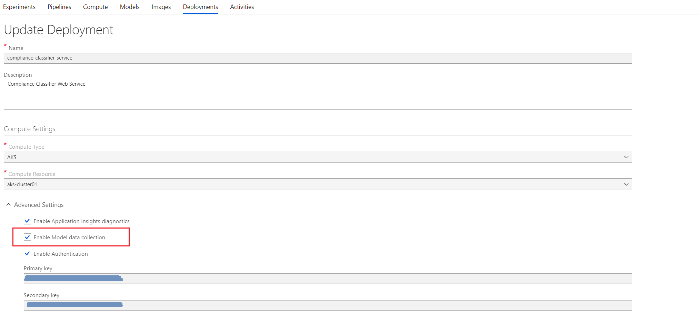
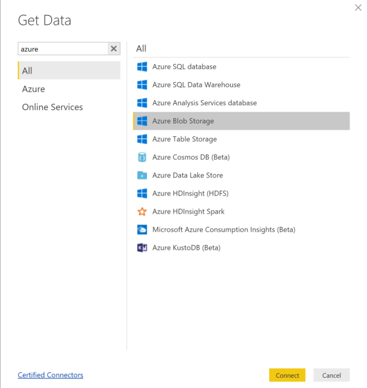
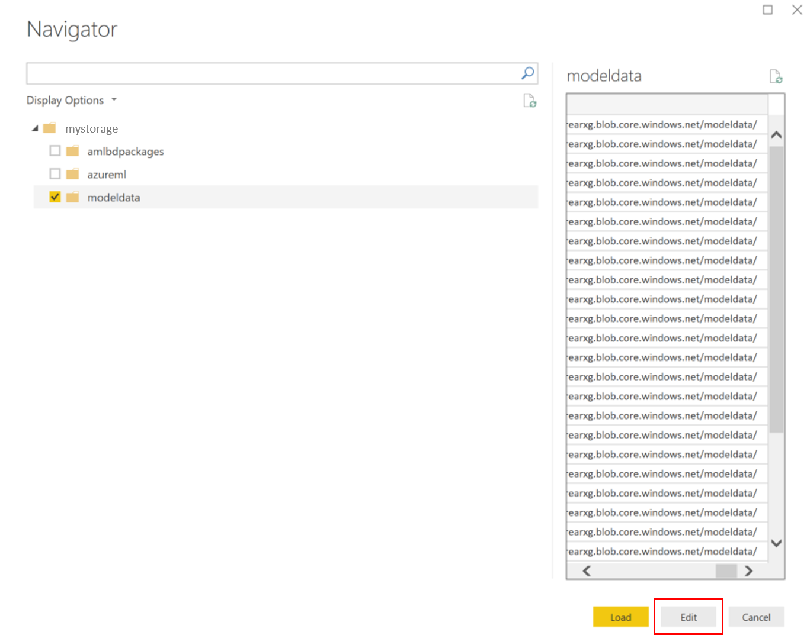
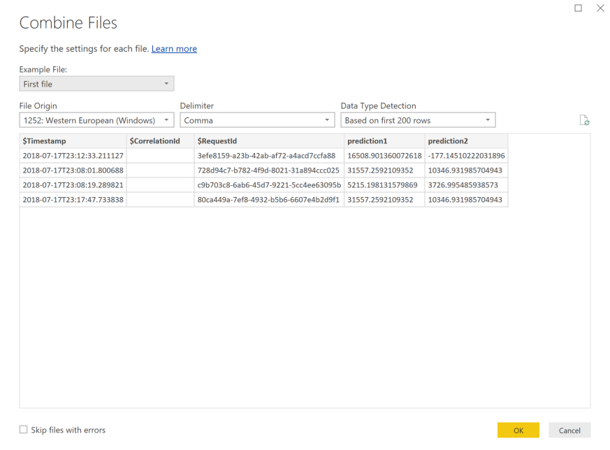
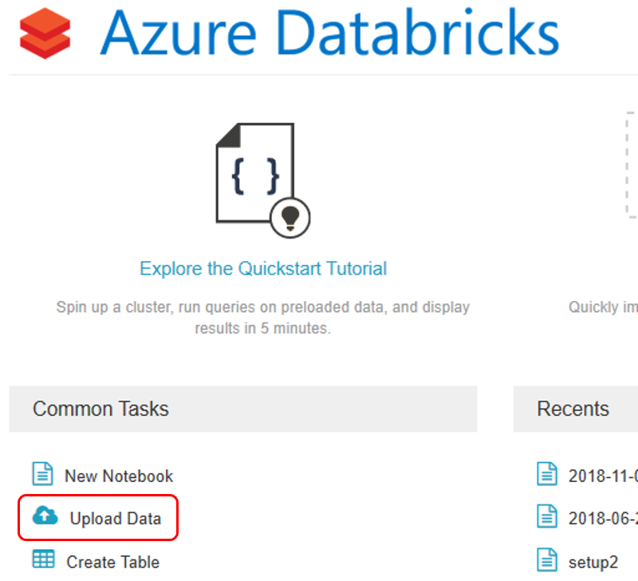
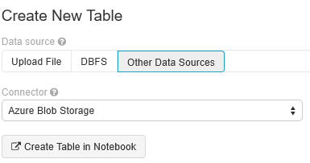
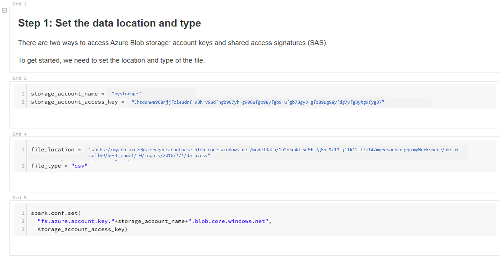

# Production monitoring of model input data and the deployed model predictions using the AML Model data collection

The following types of data can be collected for monitoring purposes:

- Production model input data
- Model predictions based on production input data

Azure Machine Learning service will save all data in Azure blob storage (in the associated storage account that gets automatically provisioned when the service itself is provisioned). The path has the following template:

```
/modeldata/<subscriptionid>/<resourcegroup>/<workspace>/<webservice>/<model>/<version>/<identifier>/<year>/<month>/<day>/data.csv
```

Here is an example of a `data.csv` file generated by the data collection feature:


## Enabling data collection

To enable data collection, you need to have the proper dependencies added to your scoring file. Once you have these in place, you can use the Azure portal to enable data collection for your production model:



Deploying a trained model to production is described in the [Overview of deployment target options](../../model-deployment/deployment-target-options.md) section.

Enabling data collection using the SDK is described in the [Monitoring a deployed model's collected data and telemetry (Code Sample)](../monitoring-data-and-telemetry-code-sample.md) section.

## Querying and analyzing monitoring data

Since the collected data is made available in CSV format in blob storage, you can use any tool to query and analyze the data. Some of the most popular options are [Power BI](https://powerbi.microsoft.com/en-us/desktop/) and [Azure Databricks](https://azure.microsoft.com/services/databricks/).

### Power BI Desktop

Using Power BI Desktop, you can connect to the storage account used by Azure Machine Learning service to store collected data:



Once you are connected, you can select the `modeldata` container and access all files:



Finaly, using Power BI data language capabilities, you can combine all CSV files into a single virtual data space that will provide data for your Power BI reports and dashboards:



Alternatively, you can filter the selection and keep only the days/months/years you are interested in.

### Azure Databricks

In cases where you need some more advanced data processing capabilities and/or superior computing power (e.g. when you collect significant amounts of data), Azure Databricks might be your choice.

Using an Azure Databricks workspace, you can upload the collected data:



From there, you can map the data in the blob storage account container using the Azure Blob Storage connector:



All that's left is to use the `spark.conf` utility to set the credentials needed to access the storage account:



You can now use Azure Databricks to perform complex analysis and reporting on data collected from you production model.

## Next steps

You can learn more about production monitoring of model input data and model predictions by reviewing these links to additional resources:

- [Collect data for models in production](https://docs.microsoft.com/azure/machine-learning/service/how-to-enable-data-collection)

Read next: [Collecting model web service performance telemetry (e.g., request rates, response times, failure rates and exceptions) with Application Insights](./model-webservice-performance-telemetry.md)