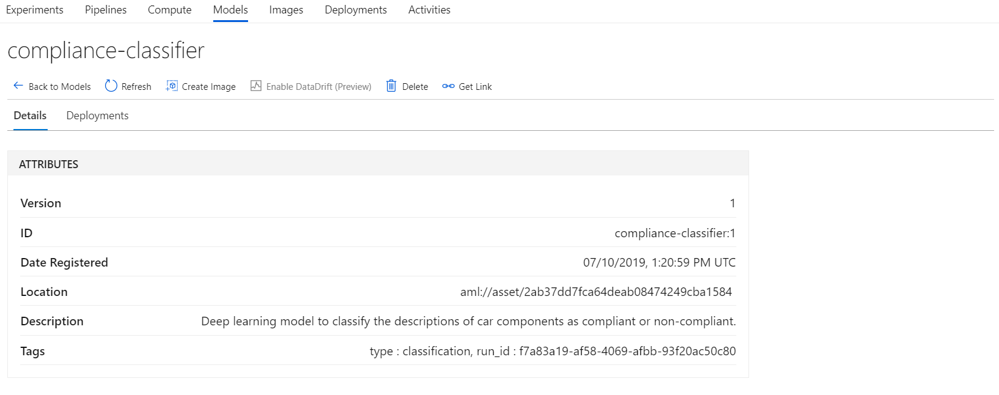

# Introducing the AML Model Registry

The most important result produced by a Run in the context of an Experiment is a Model. Basically, a trained Model is a piece of code that takes some inputs and produces some outputs and is registered with the Azure Machine Learning service. In additon to models trained by Runs, you can also register models that were trained elswhere than on a compute target provided by Azure Machine Learning. In fact, Azure Machine Learning supports any trained model that can be loaded through Python 3, regardless of where it was trained.

You can use the SDK to register a model programatically.

```python
model_description = 'Some model description.'
model = Model.register(
    model_path='model.h5',  # this points to a local file
    model_name=<model_name>,  # this is the name the model is registered as
    tags={"type": "classification", "run_id": run.id}, # tags associated to the model
    description=model_description,
    workspace=run.experiment.workspace
)
```

All registered models are available through the Azure Portal.


Every registered model has a set of properties managed by the Azure Machine Learning service.



Each model (and its associated properties) can also be retrieved programatically using the SDK.


## Model files and versions

A registered model corresponds to one or more files that make up the model. When the result of a model training contains multiple files, you can register the set of file as a single model in the Azure Machine Learning workspace. Once a model is registered, you can download any of the files that were specified during registration.

Within the context provided by the same model name, multiple versions cand be managed. Each new model registration referring to the same name results in a new version being created (using increments of 1). It is also recommended to use the tags mechanism provided by the Model Registry to tag each registered model version. This will help a lot later in searching for a specific model or a specific model version.

## Next steps

You can learn more about the Model Registry by reviewing these links to additional resources:

- [How Azure Machine Learning service works: Architecture and concepts - Models](https://docs.microsoft.com/azure/machine-learning/service/concept-azure-machine-learning-architecture#models)

Read next: [Model Evaluation introduced](./model-evaluation.md)
