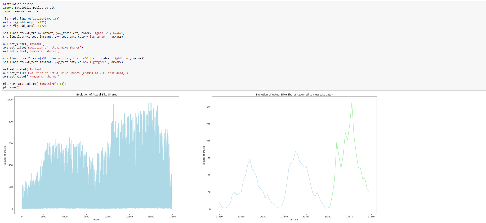
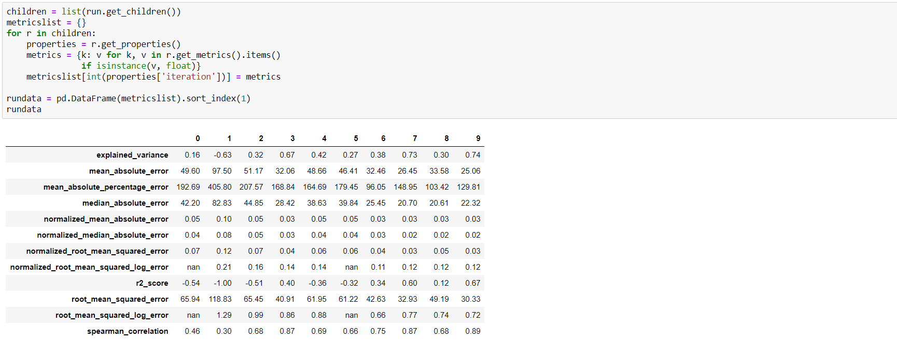
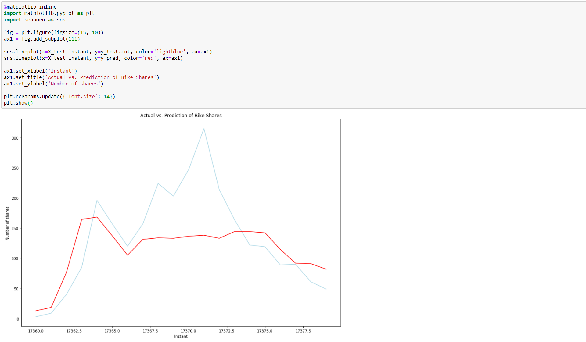

# Using automated machine learning for Forecasting (Code Sample)

## The dataset used in this example

In this regression example we will solve the problem of forecasting the number of bike rentals using the [UCI Bike Sharing Dataset](https://archive.ics.uci.edu/ml/datasets/Bike+Sharing+Dataset) which is based on real data from the Capital Bikeshare company that maintains a bike rental network in Washington DC in the United States. The dataset represents the number of bike rentals within a specific hour of a day in the years 2011 and year 2012 and contains 17389 rows and 17 columns. The raw feature set contains weather conditions (temperature/humidity/wind speed) and the type of the day (holiday/weekday). The field to forecast is the `cnt` count, which represents the bike rentals within a specific hour and which ranges from 1 to 977.

Note: All code snippets in this section are designed to run in [Azure Notebooks](https://notebooks.azure.com/).

## Prepare your environment

The first step you will perform is installing/updating your Azure Machine Learning service SDK:

```python
!pip install --upgrade azureml-sdk[notebooks,explain,automl,contrib]
```

Once you have the latest version of the SDK, you will need to do the necessary imports and create a local folder to store various artifacts:

```python
import os
import logging
import numpy as np
import pandas as pd
from sklearn.model_selection import train_test_split

import azureml.core
from azureml.core import Workspace, Experiment
from azureml.core.authentication import InteractiveLoginAuthentication
from azureml.core.compute import ComputeTarget, AmlCompute
from azureml.core.runconfig import RunConfiguration
from azureml.core.conda_dependencies import CondaDependencies

import azureml.dataprep as dprep

from azureml.train.automl import AutoMLConfig
from azureml.train.automl.run import AutoMLRun

from azureml.widgets import RunDetails

experiment_name = 'bike-sharing-forecasting'
project_folder = './bike-sharing-forecasting'

# Create a project_folder if it doesn't exist
if not os.path.exists(project_folder):
    os.makedirs(project_folder)
```

Next, get a hold on the compute resource you will use to train your model:

```python
cpu_cluster = ComputeTarget(workspace=ws, name='aml01')
```

Note: The creation of the `Workspace` variable `ws` is ommited for brewity. Also, we are assuming there already exists an Azure Machine Learning compute resource named `aml01` (which means we are going to submit an AutoML experiment run to a remote compute resource, not the local machine).

## Prepare input data

Once everything is in place, you will start loading, analyzing, and preparing your input data:

```python
data_flow = dprep.read_csv('https://quickstartsws9073123377.blob.core.windows.net/azureml-blobstore-0d1c4218-a5f9-418b-bf55-902b65277b85/bike/bike-rental-hour.csv',
                           header=dprep.api.dataflow.PromoteHeadersMode.UNGROUPED,
                          infer_column_types=True)

X = data_flow.keep_columns(['instant', 'season','mnth','hr','holiday','weekday','workingday','weathersit','temp','atemp','hum','windspeed']).to_pandas_dataframe()
y = data_flow.keep_columns(['cnt']).to_pandas_dataframe()

X_train = X[:-20]
X_test = X[-20:]
y_train = y[:-20]
y_test = y[-20:]

data_flow.get_profile()
```

Notice how we are splitting the original data set into input features (`X`) and output(`y`) - the numerical feature we are looking to forecast. Also notice the list of input features we are considering for our forecasting model. For the purpose of testing our model, we are holding out the last 20 values of the series as test data.

Let's visualize the evolution of the time series data (and also highlight training and test data):



## Create the AutoML configuration

The following elements are needed to create an AutoML configuration:

- A data script which will be used on the remote compute resource to get the data to train the model.
- A `RunConfiguration` which provides details about the creation and initialization of the Python environment on the remote compute resource.
- A set of AutoML experiment settings including the number of iterations, the maximum time the experiment is allowed to run, the primary metric used to rank resulting models,and the level of logging.

The data script must be saved localy (as it will be referenced by the AutoML configuration) and it has basically the same code you used above to prepare input data:

```python
%%writefile $project_folder/get_data.py

import azureml.dataprep as dprep
from sklearn.model_selection import train_test_split

def get_data():

    data_flow = dprep.read_csv('https://quickstartsws9073123377.blob.core.windows.net/azureml-blobstore-0d1c4218-a5f9-418b-bf55-902b65277b85/bike/bike-rental-hour.csv',
                           header=dprep.api.dataflow.PromoteHeadersMode.UNGROUPED,
                          infer_column_types=True)

    X = data_flow.keep_columns(['instant', 'season','mnth','hr','holiday','weekday','workingday','weathersit','temp','atemp','hum','windspeed']).to_pandas_dataframe()
    y = data_flow.keep_columns(['cnt']).to_pandas_dataframe()

    X_train = X[:-20]
    y_train = y[:-20]

    return { "X" : X_train, "y" : y_train.values.flatten() }
```

The run configuration includes details about the remote compute resource, the image used to initialize, and the library dependencies that need to be installed:

```python
run_config = RunConfiguration(framework="python")
run_config.target = cpu_cluster
run_config.environment.docker.enabled = True
run_config.environment.docker.base_image = azureml.core.runconfig.DEFAULT_CPU_IMAGE

dependencies = CondaDependencies.create(
    pip_packages=["scikit-learn", "azureml-sdk[automl]","azureml-dataprep", "azureml-explain-model"])
run_config.environment.python.conda_dependencies = dependencies
```

Finally, you create the settings object and then initialize the `AutoMLConfig` object:

```python
automl_settings = {
    "name": experiment_name,
    "iteration_timeout_minutes": 10,
    "iterations": 10,
    "n_cross_validations": 5,
    "primary_metric": 'normalized_root_mean_squared_error',
    "max_concurrent_iterations": 10,
    "verbosity": logging.INFO,

    "time_column_name": "instant",
    "max_horizon": 20
}

automl_config = AutoMLConfig(task='forecasting',
                             debug_log='automl_errors.log',
                             path=project_folder,
                             compute_target=cpu_cluster,
                             run_configuration=run_config,
                             data_script=project_folder + "/get_data.py",
                             model_explainability=True,
                             **automl_settings,
                             )
```

We have now defined a regression task that will use the `normalized_root_mean_squared_error` measure as primary metric for model ranking (and selection).

## Running the AutoML experiment

Once you have the `AutoMLConfig` object properly initialized, you are ready to submit your experiment. Depending on the various settings you used, the experiment will run for several minutes or more. Using the `show_output=True` options enables you to get updates on the execution.


Note how the best value of the specified metric (normalized_root_mean_squared_error in our case) is tracked throughout the entire execution. In this particular example, the `VotingEnsemble` pipeline yielded the top trained model, with an error of 0.0311.

Once the execution is finished you can request detailed information about the results.


Also, you can get all the metrics recorded during the experiment run.



## Retrieve the best model and use it on test data

Now that you have several trained models ranked based on the metric you specified when configuring the AutoML experiment, you can retrieve the best one and either use it to score immediately (on test data for example) or register and deploy is as a service.

Retrieving the best model and using it to score on test data requires the use of `get_output()`:

```python
best_run, fitted_model = run.get_output()

y_query = y_test.values.copy().astype(np.float)
y_query.fill(np.nan)

y_pred, X_trans = fitted_model.forecast(X_test, y_query)
```

You can also create a visual representation of the scoring on test data:



While not perfect, the model has picked up correctly the trend of the data. Also notice how the first few instants are better predicted than subsequent

You have now successfully configured an AutoML experiment, submitted it to run on a remote compute resource, analyzed the results it produced, retrieved its best trained model, and used this best model to score on test data.

## Next steps

You can learn more about using automated machine learning for Forecasting by reviewing these links to additional resources:

- [What is automated machine learning?](https://docs.microsoft.com/en-us/azure/machine-learning/service/concept-automated-ml)

Read next: [Understanding automated machine learning generated models, using the model explainability capability of automated machine learning](./automl-understand-models-with-explainability.md)
