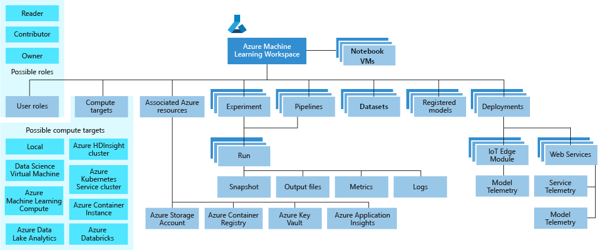
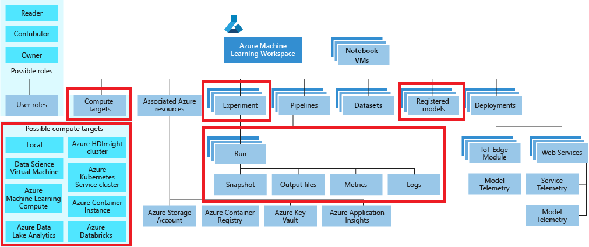

# Model Training introduced

The training of a Machine Learning model is the process through which a mathematical model is built from data that contains both inputs and expected outcomes (or only inputs in the case of unsupervised learning). There are several classes of algorithms available to build the model, like classification, regression, clustering, feature learning, and others.

Azure Machine Learning service provides a comprehensive environment to implement data science processes, giving you a centralized place to work with all the artifacts involved in the process. The top level resource for an instance of the Azure Machine Learning service is the workspace. The following diagram illustrates the high level taxonomy of the workspace:

The following table provides a brief description of all the elements from this taxonomy that are involved in the Model Training process.

| Name           | Description                                                                                                                                                                                                  |
| -------------- | ------------------------------------------------------------------------------------------------------------------------------------------------------------------------------------------------------------ |
| Experiment     | A generic context for handling runs. Think about it a logical entity you can use to organize your Model Training processes.                                                                                  |
| Run            | A Model Training run used to build a trained model. Contains all artifacts associated with a training process, like output files, metrics, logs, and a snapshot of the directory that contains your scripts. |
| Estimator      | An Estimator is an alternative higher-level abstraction used to construct run configurations when training deep learning models.                                                                             |
| Compute target | Defines a compute resource used to either run a Model Training script or host a service deployment (associated with a trained Machine Learning model).                                                       |
| Model registry | Keeps track of all models in an Azure Machine Learning workspace. Models are either produced by a Run or originating from outside Azure Machine Learning (and made available via model registration).        |

In this section we will focus on the following:

- [Introducing the AML Experiment and Runs](./aml-experiment-runs.md)
- [Introducing AML Estimators](./aml-estimators.md)
- [Introducing AML compute options (local and Azure Machine Learning compute)](./aml-compute-options.md)
- [Introducing the AML Model Registry](./aml-model-registry.md)

The following diagram identifies the positions of these elements in the high level taxonomy of the Azure Machine Learning workspace:

## Next steps

You can learn more about Model Training by reviewing these links to additional resources:

- [How to choose algorithms for Azure Machine Learning](https://docs.microsoft.com/azure/machine-learning/studio/algorithm-choice)
- [How Azure Machine Learning service works: Architecture and concepts](https://docs.microsoft.com/azure/machine-learning/service/concept-azure-machine-learning-architecture)
- [What is an Azure Machine Learning service workspace?](https://docs.microsoft.com/azure/machine-learning/service/concept-workspace)

### Related topics

- [Feature Engineering introduced](./feature-engineering-training-evaluation-selection.md#feature-engineering-introduced)
- [Model Evaluation introduced](./model-evaluation.md)

Read next: [Introducing the AML Experiment and Runs](./aml-experiment-runs.md)
