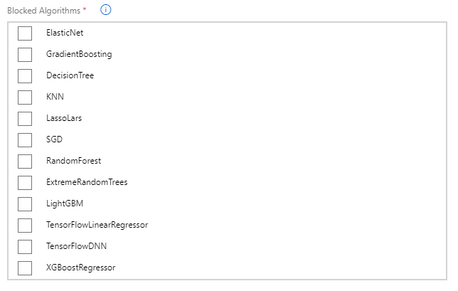
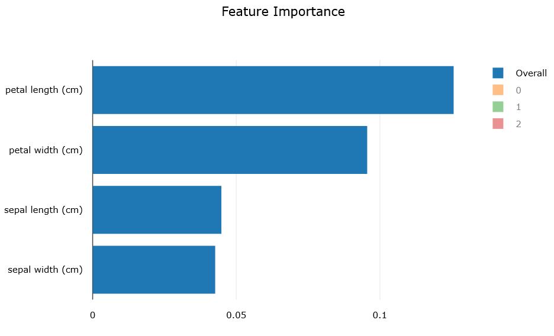

# Simplify the process with Automated Machine Learning, a component of Azure Machine Learning service

One of the most popular directions in modern Machine Learning is the automation of processes like feature engineering and selection, model selection, and hyperparameter tuning. The potential in this area is significant and the promise is to assist both seasoned professionals and beginners with jumpstarting their model development processes. This field is commonly referred as Automated Machine Learning (the AutoML abbreviated form is also used quite often).

## What is automated machine learning (the concept)?

Developing a machine learning model usually involves multiple iterations using combinations of the following:

- Features available in the data sets
- Algorithms that are suitable for the task
- Parameter values that set the behavior of these algorithms (commonly referred as hyper-parameters)
- Metrics used to measure model performance

The exploratory nature of machine learning development is very well described by the large number of these potential combinations. In fact, in many cases it is practically impossible to cover every single valid combination. Enters automated machine learning (simply referred as autoML).

The fundamental idea behind autoML is to enable the automated exploration of the above-mentioned combinations governed by an initial set of constraints defined as inputs for the process. Examples of such constraints include:

- The compute resources to be used.
- The machine learning prediction task type – currently only Classification, Regression, and Forecasting are supported (internally, Forecasting - which is a Time-Series prediction task - is handled as a multivariate regression problem).
- The metric used for performance evaluation – like accuracy, spearman_correlation, normalized_root_mean_squared_error, and others.
- Whether preprocessing should be used or not.
- Exit criteria – limits imposed on the number of iterations, time of execution, and performance metric threshold.
- Model validation approach to be used.
- Concurrency levels.
- Algorithms to be included/excluded into the evaluation.

These constraints enable you to control the output being produced as well as the resources being consumed to create that output.

### How does automML work?

Once you have specified the constraints that govern the automated exploration process, Azure Machine Learning autoML will create a number of parallel pipelines that will different models using different values for their hyper-parameters. Based on the performance evaluation metric that you specified, a ordered list of trained models is maintained and updated continuously (at a specified interval of time) during the exploration process.

The following diagram describes at a conceptual level how autoML works:


There are two ways to interact with Azure Machine Learning service autoML:

- Using the Azure Portal (user interface)
- Using the Azure Machine Learning service SDK for Python (code)

All trained models are serialized as `.pkl` files which can be later accessed through the SDK or even manually downloaded from the Azure Portal and used for scoring. They can also be deployed using the model deployment services provided by the Azure Machine Learning service.

The following diagram describes in more detail how autoML works:


For each trained model, the service will log training information, including performance metrics. Read the [Measuring performance of classification and regression models](../feature-engineering-training-evaluation-selection/model-evaluation/measure-performance-regression-classification.md) section for a detailed discussion about performance metrics and charts produced by autoML.

## Capabilities of automated machine learning (the feature): feature engineering, algorithm selection, hyperparameter tuning, and model explainability

The following table describes the most powerful capabilities of autoML:

| Name                  | Description                                                                                                                                                                                                                                                                                                                                                                                                                                                                                                                                                                                                                             |
| --------------------- | --------------------------------------------------------------------------------------------------------------------------------------------------------------------------------------------------------------------------------------------------------------------------------------------------------------------------------------------------------------------------------------------------------------------------------------------------------------------------------------------------------------------------------------------------------------------------------------------------------------------------------------- |
| Feature engineering   | Feature Engineering is a process which results in new features being derived from the original features available in the data set(s). In most cases, enrichment is followed by a feature selection process aimed towards reducing the dimensionality of the training problem. In addition to standard preprocessing which is included in every autoML experiment, you have an option to use advanced preprocessing which actually performs feature engineering. Read the [Feature Engineering introduced](../feature-engineering-training-evaluation-selection/feature-engineering-introduced.md) section for a conceptual introduction |
| Algorithm selection   | For any given machine learning task, there are a number of candidate machine learning algorithms that can be used to train models. AutoML has support for multiple algorithms that it will use during the automated experimentation process.                                                                                                                                                                                                                                                                                                                                                                                            |
| Hyperparameter tuning | Hyperparameters are algorithm parameters that govern the model training process. Within the context provided by the same algorithm, different values set for a hyperparameter will yield potentially very different results. Choosing the right value for a hyperparameter is one of the most important challenges faced when training machine learning models. An example of a hyperparameter is the number of nodes in a hidden layer of a deep neural net. AutoML has built-in capabilities for hyperparameter tuning.                                                                                                               |
| Model explainability  | AutoML enables you to understand the relative importance of each feature that was used to train a model. This is commonly referred as global feature importance. In the particular case of classification, the feature importance can be assessed at class level rather than globally.                                                                                                                                                                                                                                                                                                                                                  |

### Feature engineering

For each experiment running in autoML, the process of data preprocessing is split into the following stages:

- Standard preprocessing (occurs automatically)
- Advanced preprocessing - feature engineering (occurs optionally, if requested)

The standard preprocessing step deals with scaling and normalizing data using the following types of algorithms:

- StandardScalerWrapper
- MinMaxScalar
- MaxAbsScalar
- RobustScalar
- PCA
- TruncatedSVDWrapper
- SparseNormalizer

See the [Automatic preprocessing (standard)](https://docs.microsoft.com/en-us/azure/machine-learning/service/concept-automated-ml#automatic-preprocessing-standard) section in [What is automated machine learning?](https://docs.microsoft.com/en-us/azure/machine-learning/service/concept-automated-ml) for details about these algorithms.

The advanced preprocessing step deals with the actual feature engineering process. There are several types of actions performed like:

- Eliminate features with very high cardinality or no variance and impute missing values.
- Generate new features from `DateTime` and text values.
- Transform, encode, and/or embed features.
- Compute measures like `Weight of Distance` (WoE) or `Cluster Distance`.

See the [Advanced preprocessing](https://docs.microsoft.com/en-us/azure/machine-learning/service/how-to-create-portal-experiments#advanced-preprocessing) section in [Create and explore automated machine learning experiments in the Azure portal](https://docs.microsoft.com/en-us/azure/machine-learning/service/how-to-create-portal-experiments) for details about these approaches.

### Algorithm selection

The list of available algorithms for each type of prediction task supported by autoML (Classification, Regression, and Forecasting) includes multiple choices like `Logistic Regression`, `LightGBM`, `Decision Tree`, `Random Forest`, `Xgboost`, to name just a few. The availability of a given algorithm depends on the type of prediction task specified when configuring the autoML experiment. See the [Select your experiment type](https://docs.microsoft.com/en-us/azure/machine-learning/service/how-to-configure-auto-train#select-your-experiment-type) section in [Configure automated ML experiments in Python](https://docs.microsoft.com/en-us/azure/machine-learning/service/how-to-configure-auto-train) for details about all available algorithms.

By default, autoML will take into consideration all the algorithms that are available for a given type of prediction task. When configuring the experiment (either through the Azure Portal or the Python SDK), you have the option specify which ones should not be considered. This is especially useful when you're using autoML for a task about which you know upfront that one or more algorithms yield poor results.

The following image shows the options you have when using the Azure Portal:



One final interesting feature that autoML provides is support for [Ensemble Learning](https://en.wikipedia.org/wiki/Ensemble_learning) which basically combines the output of multiple models and derives from it a combined result. The ensemble learning will usually be the last step that an autoML experiment runs.

### Hyperparameter tuning

Hyperparameters are algorithm parameters that govern the model training process. Within the context provided by the same algorithm, different values set for a hyperparameter will yield potentially very different results. Choosing the right value for a hyperparameter is one of the most important challenges faced when training machine learning models. An example of a hyperparameter is the number of nodes in a hidden layer of a deep neural net. AutoML has built-in capabilities for hyperparameter tuning.

### Model explainability

Model explainability (also referred as model interpretability) gives you the information that is necessary to explain why a certain trained model made a certain prediction.

Here is an example that shows global feature importance for a classical machine learning prediction problem (the iris classification):



From this we can see that the most important feature when it comes to predict the type of iris is the `petal length (cm)`, followed by `petal width (cm)`. The least important is `sepal width (cm)`.

To get access to the model explainability features you will need to use the Python SDK. The core explainability functionality is built into the `azureml.explain.model` package and the dedicated autoML part into the `azureml.train.automl.automlexplainer` package.

Here is an example on how to use the SDK to get the model explainability once the experiment is finished:

```python
from azureml.train.automl.automlexplainer import explain_model

shap_values, expected_values, overall_summary, overall_imp, per_class_summary, per_class_imp = \
    explain_model(fitted_model, X_train, X_test)

#Overall feature importance
print(overall_imp)
print(overall_summary)

#Class-level feature importance
print(per_class_imp)
print(per_class_summary)
```

Note that you will need to provide a validation dataset if you want to get class-level feature importance. Also, if you set the `model_explainability` flag in the autoML configuration, feature important will become available for all iterations. In this case, you can use `retrieve_model_explanation` to get feature importance for a certain iteration, as follows:

```python
from azureml.train.automl.automlexplainer import retrieve_model_explanation

shap_values, expected_values, overall_summary, overall_imp, per_class_summary, per_class_imp = \
    retrieve_model_explanation(best_run)

#Overall feature importance
print(overall_imp)
print(overall_summary)

#Class-level feature importance
print(per_class_imp)
print(per_class_summary)
```

## Next steps

You can learn more about Automated Machine Learning by reviewing these links to additional resources:

- [What is automated machine learning?](https://docs.microsoft.com/en-us/azure/machine-learning/service/concept-automated-ml)
- [Configure automated ML experiments in Python](https://docs.microsoft.com/en-us/azure/machine-learning/service/how-to-configure-auto-train)
- [Create and explore automated machine learning experiments in the Azure portal (Preview)](https://docs.microsoft.com/en-us/azure/machine-learning/service/how-to-create-portal-experiments)
- [Train models with automated machine learning in the cloud](https://docs.microsoft.com/en-us/azure/machine-learning/service/how-to-auto-train-remote)
- [Evaluate training accuracy in automated ML with metrics](https://docs.microsoft.com/en-us/azure/machine-learning/service/how-to-understand-accuracy-metrics)
- [Configure automated ML experiments in Python](https://docs.microsoft.com/en-us/azure/machine-learning/service/how-to-configure-auto-train)
- [Create and explore automated machine learning experiments in the Azure portal](https://docs.microsoft.com/en-us/azure/machine-learning/service/how-to-create-portal-experiments)
- [Model interpretability with Azure Machine Learning service](https://docs.microsoft.com/en-us/azure/machine-learning/service/machine-learning-interpretability-explainability)
- [Understand automated machine learning results](https://docs.microsoft.com/en-us/azure/machine-learning/service/how-to-understand-automated-ml)

Read next: [Leveraging automated machine learning to train models for classification, regression, and forecasting](./automl-for-classification-regression-forecasting.md)
