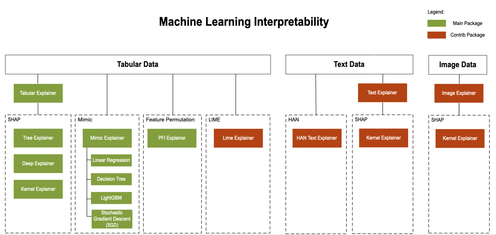

# Understanding automated machine learning generated models, using the model explainability capability of automated machine learning

While training a good machine learning model is very important, it is almost equally important in many cases to have the ability to interpret and explain the behavior of that trained model. This capability is commonly referred as explainability or interpretability (sometimes these terms are used interchangeably). The insights it generates can be used to validate model behavior and various hypotheses, get insights for debugging, and, ultimately, build trust with the beneficiaries of the model.

There are two major aspects of model explainability:
- Understand global behavior (commonly referred as global explanation)
- Understand specific predictions generated by the model (commonly referred as local explanation)

## Explainability defined

The typical approach in machine learning is to use a set of data fields (referred as features) to predict the likely value of a target field. A trained model is essentially a function that takes the values of these features and computes a result which is the predicted value. One of the difficult problems with this approach has always been the opacity of this function or, in other words, the degree to which the inner working of the function can be understood and explained. This opacity depends quite a lot on the class of algorithm used to train the model. For example, decision tree algorithms produce one of the least opaque trained models (commonly referred as decision trees) which are essentially self-explanatory. At the other end of the spectrum, deep neural network algorithms produce of the opaquest models (which are essentially a set of numeric weights quite difficult to understand and explain).

One of the most important aspects of model explainability is **feature importance** which tells for each input feature how important is its contribution to the resulting prediction. Take for example the [bike sharing prediction](../automl-for-classification-regression-forecasting/automl-regression-code-sample.md) problem we have referred in a few places in this guide. Some of the features taken into consideration when predicting the number of bike rentals are `season`,`mnth`,`hr`,`holiday`,`weekday`,`workingday`,`weathersit`,`temp`,`atemp`,`hum`, and `windspeed`. Once a model is trained, one might find out that `hr` may be highly important in the final prediction while `weekday` may be less important. 

The methods used to explain models can be also catgorized into:
- Model agnostic methods - can be applied to any model, regardless of the algorithm used to train it
- Model specifc methods - target only certain types of models (like tree-based models for example)

The following table lists the SDK packages that provide support for explainability.

Package | Description
--- | ---
azureml.explain.model | The main package, fully supported by Microsoft.
azureml.train.automl.automlexplainer | The package for autoML models, also supported by Microsoft.
azureml.contrib.explain.model | Experimental functionalities in preview, no support.

The SDK contains two sets of explainers (Direct Explainers and Meta Explainers) which are detailed below.

## Direct Explainers

Direct explainers are integrated into the SDK and expose a common output format and API. Thus, they can be directly invoked by your code. The following table lists the direct explainers available in the SDK.

Explainer | Description
--- | ---
SHAP Tree Explainer | Focused on trees and ensembles of trees (uses the polynomial time fast SHAP value estimation algorithm).
SHAP Deep Explainer | Focused on deep learning models (uses a high-speed aproximation algorithm based on [DeepLIFT](https://arxiv.org/abs/1704.02685)). Has full support for TensorFlow (and Keras) and preliminary support for PyTorch.
SHAP Kernel Explainer | Can be applied to any model (uses a variant of linear regression to estimate SHAP values).
Mimic Explainer | Based on the concept of a global surrogate model that is intrinsically explainable. This surrogate model is trained to approximate the predictions of the original black box model.
Permutation Feature Importance Explainer | Focused on classification and regression models (uses an [approach proposed for random forests](https://www.stat.berkeley.edu/~breiman/randomforest2001.pdf)).
LIME Explainer | Focused on classifiers, aims to explain indifidual predictions by training local surrogate models.
HAN Text Explainer | Focused on text data (trains a surrogate model on a given model's outputs then optimizes for a specific document).

**Notes:**

The official defintion of [SHAP](https://shap.readthedocs.io/en/latest/) is:

>*SHAP (SHapley Additive exPlanations) is a unified approach to explain the output of any machine learning model. SHAP connects game theory with local explanations, uniting several previous methods and representing the only possible consistent and locally accurate additive feature attribution method based on expectations (see the SHAP NIPS paper for details).*

LIME stands for Local Interpretable Model-agnostics Explanations and has been originally proposed in the ["Why Should I Trust You?" - Explaining the Predictions of Any Classifier](https://arxiv.org/pdf/1602.04938.pdf) paper.

HAN stands for Hierarchical Attention Networks ahd has been originally proposed in the [Hierarchical Attention Networks for Document Classification](https://www.cs.cmu.edu/~diyiy/docs/naacl16.pdf) paper.

## Meta Explainers

As their name implies, Meta explainers are used for automatic selection of direct explainers. Based on a given models and dataset, a meta explainer will select the best direct explainer and use it to generate the explanation information. The following table lists the meta explainers available in the SDK.

Explainer | Description
--- | ---
Tabular Explainer | Used for tabular datasets.
Text Explainer | Used for test datasets.
Image Explainer | Used for image datasets.

The following diagram shows the current relationship between meta and direct explainers.

## Use the SDK to explain models

The [Model explainability (Code Sample)](./automl-model-explainability-code-sample.md) section provides guidance on using the explainability features available in AutoML.

## Next steps

You can learn more about understanding automated machine learning generated models using the model explainability capability of azure machine learning by reviewing these links to additional resources:

- [What is automated machine learning?](https://docs.microsoft.com/en-us/azure/machine-learning/service/concept-automated-ml)
- [Model interpretability with Azure Machine Learning service](https://docs.microsoft.com/en-us/azure/machine-learning/service/machine-learning-interpretability-explainability)
- [Azure Machine Learning interpretability sample notebooks](https://github.com/Azure/MachineLearningNotebooks/tree/master/how-to-use-azureml/explain-model)

Read next: [Model explainability (Code Sample)](./automl-model-explainability-code-sample.md)